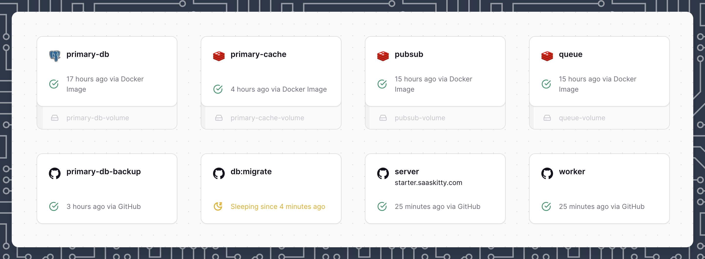
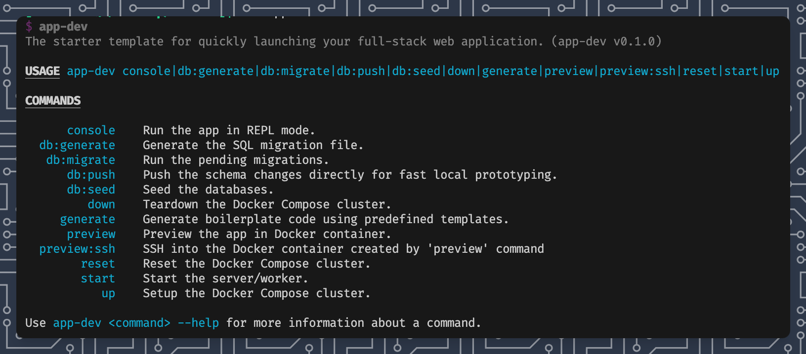

# starter

The starter template for quickly launching your full-stack web application using [saaskitty](https://saaskitty.com).

## Architecture



## Prerequisites

- Install [Docker](https://www.docker.com/products/docker-desktop/)
- Install NodeJS >= 22.0.0
- Install Bun

## Getting Started

1. Install dependencies.

```sh
bun install
```

2. Setup Postgres/Redis/S3/SMTP using [Docker Compose](https://docs.docker.com/compose/) locally.

```sh
bun app up
```

3. Start the application in development mode.

```sh
bun dev
```

> [!TIP]
> [saaskitty](https://saaskitty.com) simplifies your development process with a suite of powerful commands, accessible via `bun app <COMMAND>`.
>
> 
